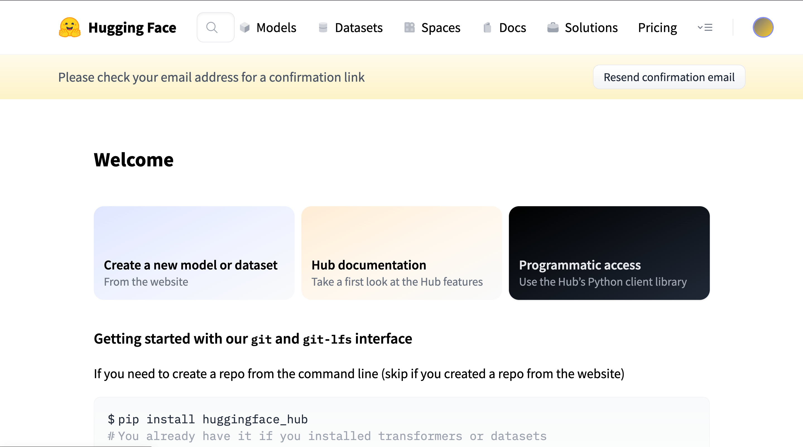
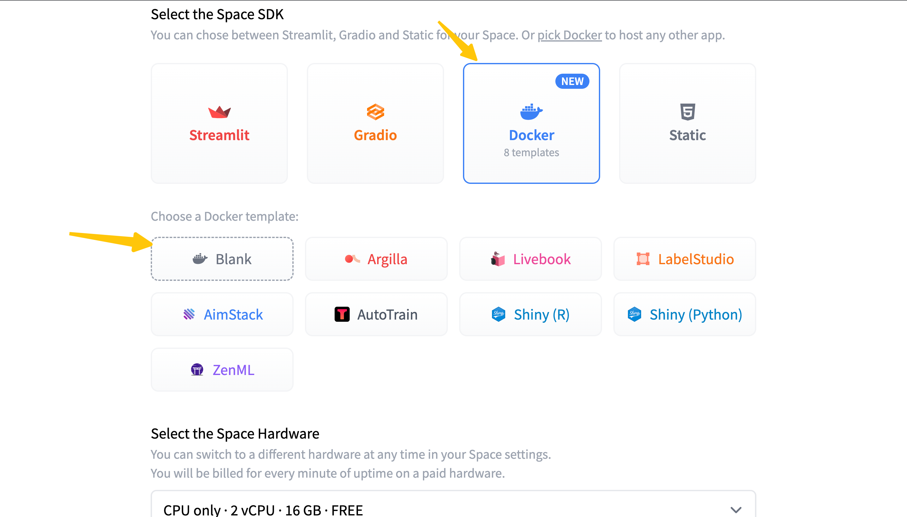
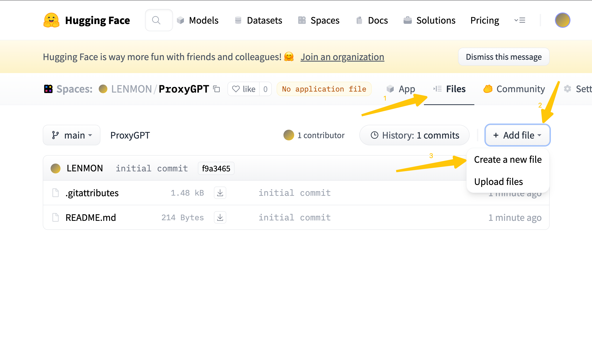
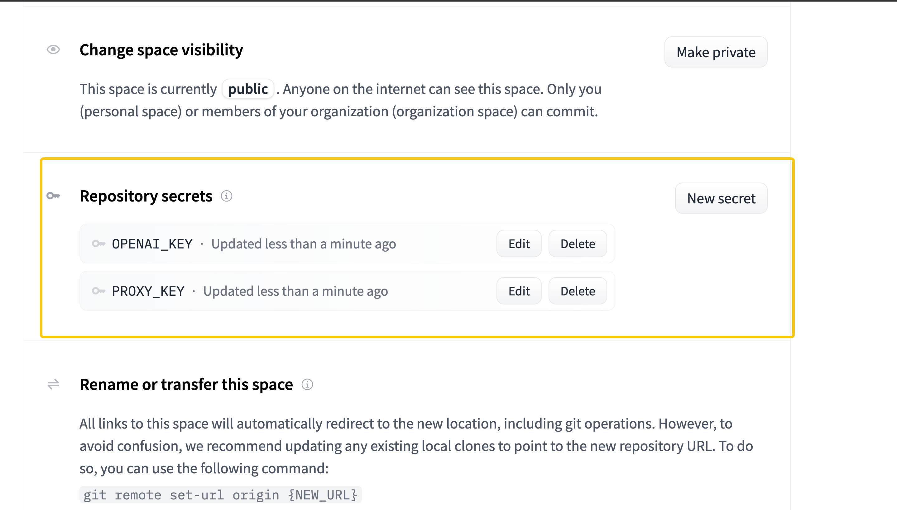
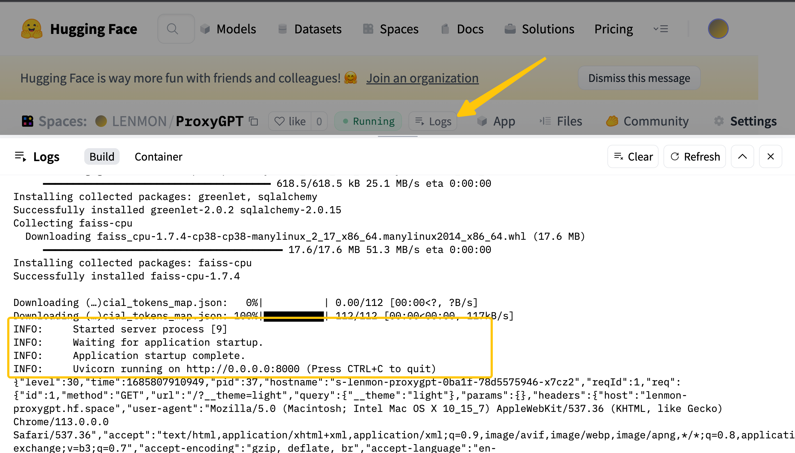
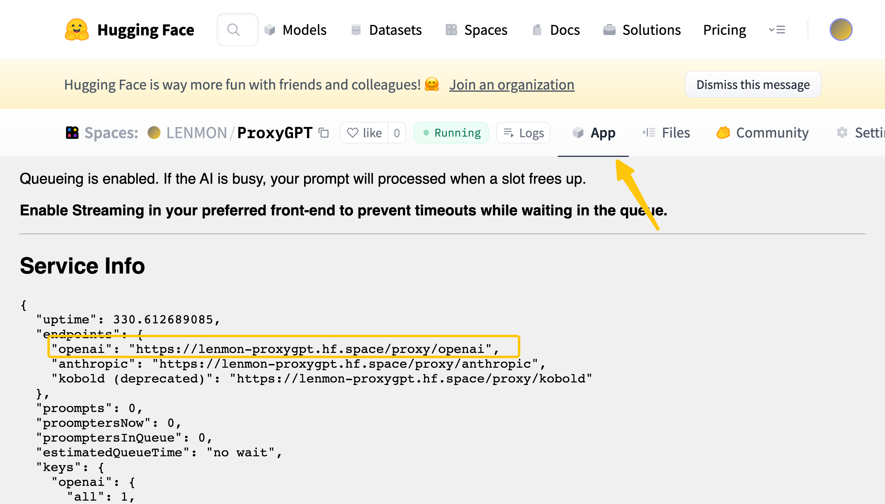
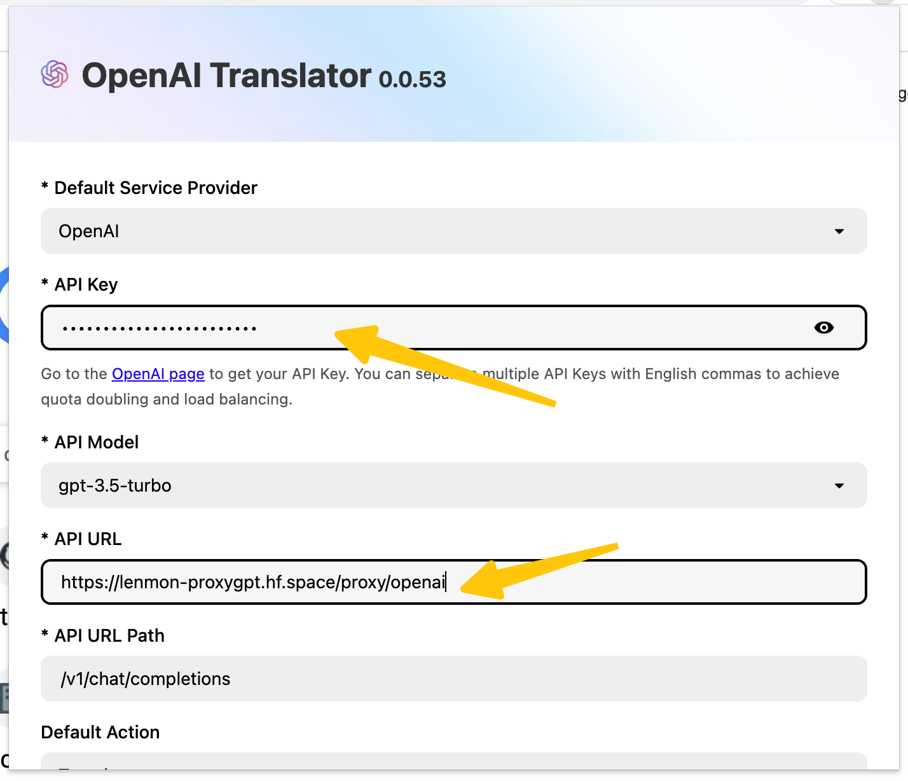
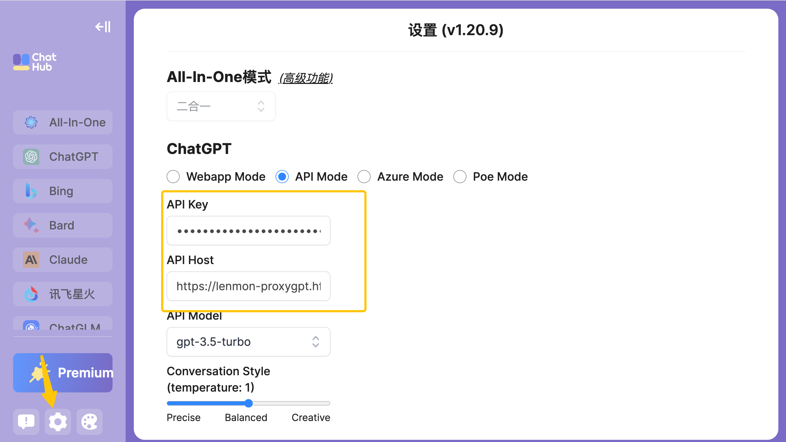

# Proxy GPT: 让你更加畅快的访问OpenAI的ChatGPT，100% 无任何费用

**声明：** 请勿用于非法或商业活动，任何用途须自己清楚相关法律和商业风险，并自己承担其所有后果，与本仓库开发者无关。

借助该工具，你可以：

1. **完全免费**，可以让你在任何地方，无须借助任何工具，轻松访问OpenAI的ChatGPT接口；
2. 类似的问题将**无须**再次付费，即：具有缓存能力；
3. 更好的**保护**你的OpenAI Key；

注：使用前须拥有OpenAI Key

## 效果预览

### [openai-translator](https://github.com/openai-translator/openai-translator)浏览器插件使用效果

https://github.com/PlusLemon/proxy-gpt/assets/135144325/e4266e96-fa15-4cfa-b781-5e8c5295cfe2

### [chathub](https://github.com/chathub-dev/chathub)浏览器插件使用效果

https://github.com/PlusLemon/proxy-gpt/assets/135144325/fa330ddc-379f-4174-9f64-1d4978ce6bb0

## 搭建步骤

<strong>请看完本页所有内容，这样使用过程中将会明白有些问题出现的原因</strong>

1. 注册[huggingface](https://huggingface.co/welcome)账号，无须翻墙，正规网站

2. 注册完成后，回到首页，点击网页最上栏 Space ，然后按钮 Create new Space，填写Space相关信息，注意 Select the Space SDK 这个选项选择Docker类型，如下图：

3. 依次点击 Files -> Add file -> Create a file，文件名称 **Dockerfile**，然后将当前该仓库目录下的Dockerfile内容复制进去

4. 点击 Settings，然后往下滑动，找到 Repository secrets 选项，点击 New Secret，弹出的两个输入框分别输入`OPENAI_KEY`和自己的openai key，然后再次点击 New Secret，弹出的两个输入框分别输入`PROXY_KEY`和自己设置的代理密钥，最后效果图如下

5. 点击 Logs 按钮，等待服务完全启动，出现一下信息表示服务已经完成启动

6. 点击 App 按钮，获取代理地址

以上就完成了代理服务的搭建！！！

## 使用配置

介绍配置前，先说明下使用中涉及到的技术。

1. [oai-reverse-proxy](https://gitgud.io/khanon/oai-reverse-proxy) 服务代理源码，非本人开发，但是由于未托管在Github上，所以本人上传了一份，后续作者上传后将删除，进行fork。在原基础上，添加了缓存能力，源码： [oai-cache-proxy](https://github.com/PlusLemon/oai-cache-proxy)
2. [GPTCache](https://github.com/zilliztech/GPTCache) LLM缓存，**目前缓存部分还需更多时间研究，可能效果不是很好，希望大家一起研究这部分，这样可以大大减少token消耗，毕竟这都是需要美金的！！！**
    - 目前缓存是通过最后一条消息进行识别，不支持会话缓存，主要是因为为了在大部分使用场景达到更好的缓存效果，如果要支持会话级别缓存，需要更多的功夫，有想法的同学可以一起讨论。
    - 有时候缓存可能会误命中，理解万岁。这个有多方面因素，如embedding模型的选择、GPTCache的配置，另外模型只能捕捉到部分语义特征，并不能完全句子中的所有语义，所以有时候会出现异常例子。

如果需要重启服务，在设置中找到** Factory reboot **进行重启，有时候可能因为缓存下载的包的问题导致无法进行依赖包的更新

**修改配置的简单方法，跟配置密钥一样配置即可**

### 模型请求速率限制

MODEL_RATE_LIMIT， 默认为4，表示每分钟4次

### 模型最大输出token数

MAX_OUTPUT_TOKENS，默认为300

### 缓存

CACHE_ALLOWED，默认true，表示开启缓存

CACHE_HOST，默认为 http://0.0.0.0:8000 ，表示GPTCache部署地址，如果有缓存自定义需求，可以进行调整

CACHE_SKIP_WORD，默认为`/skip_cache `，表示输入中包含该内容会**绕过缓存**，注意最后有一个空格。也就是说如果误命中缓存，只需要在最开始输入 `/skip_cache ` 将不会访问缓存，直接访问OpenAI ChatGPT得到答案

## 代理使用

这里以 openai-translator 和 chathub 进行举例，其他ChatGPT应用应该也是类似，对于其他类型的配置可以在下面链接查找对应的。

<strong>如果觉得本项目给你带来了帮助，帮忙点个 🌟 🌟 🌟</strong>

### openai-translator

进入设置，然后在 API KEY 输入框输入代理的key，也就是之前自定义的 PROXY_KEY，**注意不是你的OPENAI KEY**，API URL 则填写代理服务地址即可。

### chat hub

进入设置，然后在 API Key 输入框输入代理的key，然后 API Host 则填写代理服务地址即可。

### 其他

- Python
    - [openai sdk](https://platform.openai.com/docs/guides/gpt/chat-completions-api) [代理使用案例](examples/python/openai.ipynb)
    - [langchain](https://github.com/hwchase17/langchain) [代理使用案例](examples/python/langchain.ipynb)
    - [llama index](https://github.com/jerryjliu/llama_index) [代理使用案例](examples/python/llama_index.ipynb)
    - [guidance](https://github.com/microsoft/guidance) [代理使用案例](examples/python/guidance.ipynb)

## 最后

**切勿使用该技术用于非法活动！！！**

**切勿使用该技术用于非法活动！！！**

**切勿使用该技术用于非法活动！！！**

希望大家可以一起讨论如何优化代理体验，如果你有更好的配置方案，欢迎留言。
